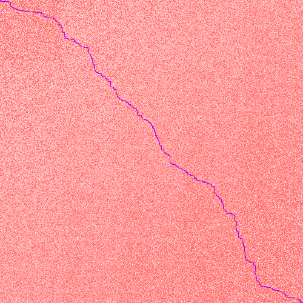

# Advent of Code 2021 in Ada

Because 3 years of pain and suffering aren't enough. :grin:
I did at least use Alire first, as well as a custom-made `Queue`.

## Days I completed on the first try, without even doing the example first

### Day 1: Sonar Sweep

Study the sea floor. You receive a number of sonar readings of bottom depth.

1. Count the number of times the depth increases.
1. Count the number of times that the sum of three consecutive depths increases.

#### Tools
Nothing special.

#### Experience
Fun and easy.

### Day 2: Dive!

You're given a bunch of commands for motion forward, up, or down.

1. Predict the sub's position.
1. You misinterpreted up and down: they aren't position, but _aim_.
   Predict now, with this information.

#### Tools
Nothing special.

#### Experience
Fun and easy.

### Day 3: Binary Diagnostic

You're given a bunch of binary numbers.
Perform diagnostics by looking at the most and least commonly-used bits.

1. Power consumption is product of gamma rate (most common bit) and
   epsilon rate (least common bit). Report it.
1. Life support rating is product of
   * oxygen generator rating, the number determined by the most common bits, and
   * carbon dioxide scrubber rating,
     the number determined by the least common bit.

   Report them.

#### Tools
* Custom `String` type for the diagnostic.

#### Experience
Fun and easy. The implementation won't work with the example input
because the string lengths are hard-coded for the puzzle input.
I could fix it, and if I find motivation then I will.

## First mistake :-( started doing examples after this

### Day 4: Giant Squid

A giant squid comes by and you decide to play bingo.
You are given a sequence of numbers that will be called, and a bunch of cards.

1. Which card will win bingo first? report the sum of its unmarked values.
1. Scratch that; the squid looks intimidating.
   Which card will win bingo _last?_ report the sum of its unmarked values.

#### Tools
* Ada's `Vector` type
* a pragma to hush a warning

#### Experience
But for the fact that I did it wrong, this was fun.

## Days I completed after doing the example first

The first couple of weeks went well, but after that it was downhill.
By the end I was doing only one puzzle a week,
because each one took me most of a day.
I don't quite understand _why_ that happened,
but the ramblings in the "Experience" section might help illuminate it.

### Day 5: Hydrothermal venture

A bunch of hydrothermal vents.
Oddly _not_ related to [Day 9](#day-9-smoke-basin).

1. Count the number of overlapping vents from those
   that line up horizontally or vertically.
1. Now count the number that add up diagonally, as well.

#### Tools
* Ada's `Vector` and `Ordered_Map` types.

#### Experience
Surprisingly uncomplicated. Quick.

### Day 6: Lanternfish

You pass some lanternfish, which are bioluminescent.
They grow according to energy levels.

1. How many do we expect to have after 80 days?
1. ...after 256 days?

#### Tools
* Ada's `Vector` type

#### Experience
This took a while because I was trying to work out a formula
alon the lines of a Lucas sequence,
of which the Fibonacci sequence is a special case;
traces of this remain in my use of the term `Lanternfishonacci` somewhere.

After squandering far too much time on that step,
I realized it wasn't gonna happen, but I also knew that
I _really_ didn't want to track individual fish, as the example suggested.
That's when I hit on the idea of tracking not individual fish,
but the number of fish, along with the number that spawned on a given day.
That worked, and was fast!
It also showed that I was right: the number of individual fish
is enormous.

### Day 7: The Treachery of Whales

A whale is chasing you, and crabs come to your help.
No, the anti-whale message ;-) doesn't make sense to me,
especially since you just passed an enormous school of tasty lanternfish
who are in desperate need of a predator to cull their numbers.
Nor does it seem to matter much for the story; the whale is soon forgotten,
but the crab bit makes some sense since their little ships
can travel only horizontally, and that's the focus of the problem.

1. Find the lowest- position where the crabs should align their ships.
1. Same, but the cost is different: each additional position to move
   costs one additiona fuel, rather than all positions being 1 fuel.

#### Tools
* Ada's `Vector` type
* an enumerated type to have a subprogram behave differently
  for different parts of the puzzle
* Mathematics! in particular, triangular numbers:
  the sum of the numbers from 1 through n is [n(n+1)]/2

#### Experience

Easy and fun. The trick with triangular numbers was a pleasure.

### Day 8: Seven Segment Search

Some displays have their wires crossed.
You have notes with 10 input signals, each of which is a unique digit,
and 4 output displays, each of which is incorrect.

1. Determine how many output displays correspond to numbers 1, 4, 7, 8,
   which we can identify uniquely by the number of their segments.
1. Determine the correct wirings and thus the correct outputs.
   Report the sum.

#### Tools
* custom character range
* Ada's `Vector`
* a pragma to shut up a warning about an unused subprogram

#### Experience

Tedious. It took me a long time to work out the correct wirings.
It wasn't hard after that, though I had a couple of false starts,
and had trouble implementing it correctly.
I don't seem to have been the only one; the leaderboard suggests
that this day took most people much longer than normal --
though the difference here is something like 7 minutes versus 1-4 minutes,
while in my case it was more like 4 hours versus 1...

### Day 9: Smoke Basin

Traveling through an area where lava tubes are releasing smoke and it...
flows _downward?!?_
The basin has high points and low points.

1. Determine the low points, calculate their risk levels, and add 'em up.
1. Find the sizes of the basins surrounding the low points.
   Report the product of the sizes of the three largest.

#### Tools
* Ada's `Hashed_Sets` type.
* My `Queue` type.

#### Experience
Not hard, not tedious. Took longer than it should have
because I used a temporary variable rather than an similarly-named record field,
but otherwise it was fun!

### Day 10: Syntax Scoring

A bunch of messages that consist entirely of opening and closing delimiters,
but they're either corrupt or incomplete.

1. determine which ones are corrupt; report syntax error score
1. complete the incomplete ones; report autocomplete score

#### Tools
* Vectors
* enumerated types
* recursion (it's a grammar, after all)

#### Experience
Not especially hard, nor tedious.
Took longer than it should have because I was a little careless.

### Day 11: Dumbo Octopus

Look at how the octopus are growing in energy; they flash at 9, so

1. determine how many flashes occur in 100 rounds
1. determine the round when they all flash

#### Tools
* Breadth-first search to determine flash spillover, which means...
* My `Queue` type

#### Experience
Not particularly challenging, not particularly tedious.

#### Visualization
This lends itself to visualization quite well.

### Day 12: Passage Pathing

Searching for all the paths through a chambered cavern.
There are two types of chambers: small (lower-case) and large (upper-case).

1. Determine the number of paths that have _no_ repetition of small chambers.
1. Determine the number of paths that have _at most one_ repetition
   of _one_ small chamber which is neither `start` nor `end`.

#### Tools
* Ada's `Vector`, `Hashed_Maps`, `Hashed_Sets`, and `Ordered_Maps`.
* Breadth-first search for paths, which means...
* My `Queue` type.

#### Experience
Getting the program to work with the examples got it to work with the input,
but it was a challenge to get it to work with the examples!
Getting set up for Part 1 was already tedious, and
while Part 2 should have been relatively quick after that,
I kept getting the logic wrong.
Worse, it's slow: part 2 takes about 45 seconds!
A first attempt at optimizing did not work;
I now suspect it's the use of `Ordered_Maps`,
but I'm done with the problem for now.
It's a nice problem! I just have to sleep at some point...

### Day 13: Transparent origami

You need to figure out the code to initialize a device
by performing a number of folds on a sheet of paper
that has seemingly random dots.
Once you do that, the initialization code should be 8 capital letters.

1. Perform only the first fold and report the number of dots.
   Do not double-count dots that overlap.
1. Perform the remaining folds and report the letters that appear.

#### Tools
* Ada's `Vectors` and `Hashed_Sets` types
* the `Get_Integer` function I wrote for Advent of Code 2022
* Mathematics! in particular, some elementary geometry of transformations

#### Experience
Fun and easy. I had to do a little debugging because I forgot in part 2
to switch away from performing the folds on `Dots` to `New_Dots`.

### Day 14: Extended Polymerization

You need to manufacture more polymer to reinforce the submarine's hull.
You are given a polymer template and rules for inserting an element
between each pair of elements.
We score the polymer by computing the difference
between the highest and lowest frequencies of elements.

1. Determine the score after 10 turns. This is a reasonable number.
1. Determine the score after 40 turns. This is an unreasonable number,
   and you won't be able to compute it directly.

#### Tools
* Ada's `Vector` and `Hashed_Map` types.
* For part 2, the `Hashed_Map` comes in quite handy.
  Instead of trying to compute the polymer directly:
  * count the number of pairs in the initial polymer;
  * then, on each turn, use that count to count the number of new pairs.

#### Experience
Mostly fun. Not quite so easy. It took me a few minutes to figure out
how to re-imagine the problem away from computing the vector directly.
Then it took me a while to debug the code.

Ada's rules on tampering with cursors are so strict that they flagged my code
even though _I was doing nothing dangerous._
Rather irritating.

### Day 15: Chiton

You are still trying to find your way out of the cavern,
and the only way out appears to be through a maze of chiton.
Each cell of the 100x100 maze (10x10 for the example) has an associated risk.
You want to find the path of least risk.

1. Find the path of least risk and report its risk factor.
1. Turns out the maze given is only a template of the actual maze!
   The actual maze is a 5x5 tiling of the original, where
   position (i,j) of tile (k,j) has the value _v_ + (_k_ - 1) + (_j_ - 1),
   where _v_ is the value of position (i,j) of the original --
   with the catch that if the new value is larger than 9,
   reduce it repeatedly by 9 until it is.
   (Not quite verbatim to the problem, but equivalent.)

#### Tools
* Ada's `Vector`, `Hashed_Map`, and `Unbounded_Priority_Queue` type, which
  implies the `Synchronized_Queue_Interfaces` type.
* Since my custom `Queue` type doesn't work for priorities,
  and it is quite likely that paths are not always added by increasing risk,
  I decided not to use that.

#### Experience.
Fun! Not easy, but thanks to AoC
I'm now well accustomed to breadth-first search,
including cases like this where you have to check the reward of a new option
against the reward of a previously queued one.

Alas, my implementation is somewhat slow:
on my laptop, it takes roughly 2m15sec to solve both parts.

#### Visualization
If the solution is difficult to make out, zoom! The image holds up well.
(Unless your browser interpolates zoomed images. Firefox is one of those.
In that case, open it in a different browser or a separate program.)

* A lowest-cost path is in _blue_.
* The more _red_ a cell has, the more chiton it has.
  I chose red because it's the color of the chiton shown on
  [the Wikipedia page](https://en.wikipedia.org/wiki/Chiton).

### Day 16: Packet Decoder

Given a fairly long packet, decode its contents.
The packet contains sub-packets.
Each packet header has a version and a type; what follows depends on the type.

1. Compute the sum of all packet versions.
1. The packet encodes a sequence of operations to perform.
   Determine the result.

#### Tools
* Ada's `Vector` and `Long_Long_Integer` types (the values grow too large)
* Recursive descent parsing
* Converting hex to binary and binary to "ordinary"

#### Experience
Fun. Should have been easy.
I misinterpreted a run-time error message that an operation overflowed
to conclude (wrongly) that I was parsing things wrong:
I thought I had an out-of-bounds index error. **sigh**

### Day 17: Trick Shot

You need to shoot a probe through a target region.
The probe is subject to drag in the x direction, and to gravity in the y.

1. Determine the largest possible vertical height
   that gets the probe into the target area.
1. Determine how many trajectories get the probe into the target area.

#### Tools
* Triangular numbers (again!)

#### Experience
This should have been fun and easy, but I misread Part 1 completely,
and ended up entering the correct dy trajectory instead of the correct height.
It was only after looking at someone else's solution,
and seeing what a large number it was, that I worked out this one.

FWIW, I wish Parts 1 and 2 had been reversed.

### Day 18: Snailfish

Some snailfish tell you they've seen the key and they'll help you find it
just so long as you help a yung'un with 'is homework.

Kind of silly, but the problem is interesting.
Snailfish numbers are written as recursive pairs, like so: (taken from puzzle)
* [[1,9],[8,5]]
* [[[[1,2],[3,4]],[[5,6],[7,8]]],9]

We only learn about sums, which consist of concatenation into a new pair,
the repeatedly
* "exploding" pairs that are too deep by adding their left (resp. right) entry
  to the closest numerical entries on the left (resp. right), then
* "splitting" any numerical entry with a value larger than 9
  into a pair that consists of its integral halves
  (rounding, if needed, left down and right up).

Numbers are then evaluated by magnitude, which is:
* for a numerical entry, the entry itself;
* for a pair, the sum of thrice the magnitude of the left
  and twice that of the right.

1. Find the magnitude of the sum of all the numbers.
1. Find the largest magnitude of the sum of any _two_ numbers.

#### Tools
* Ada's `Indefinite_Vectors` and `Indefinite_Multiway_Trees` types
* Recursion

#### Experience
Fun, but not easy, and somewhat tedious.
* It took a lot of effort merely to write the code to read the numbers in!
* I had difficulty devising a solution to the problem.
  It took me far too long to realize that trees were the right approach.
* I don't have much experience with Ada's `Multiway_Trees`,
  so I first concluded (wrongly) that it would not work for what I needed,
  and wasted too long trying to write my own data structure.
  It was only when I was about done writing that data structure that I thought,
  "these `Access` types will be a pain to debug," and
  went back to re-read the documentation on `Multiway_Trees`.
  That's when I realized it was quite doable.

Amazingly, once I wrote the code and got the reading of input debugged,
both parts worked on the first try!
Apparently the time I spent thinking about it was worth the delay.

### Day 19: Beacon Scanner

The submarine has spewed beacons and scanners all over the place,
and in order to map the area you need to determine how the scanners
are oriented to each other.

1. Orient the scanners and report how many beacons there are.
1. Report the largest distance between any two scanners.

#### Tools
* rotation matrices (optional)
* Ada's `Vector` and `Hashed_Set` types.
* a lot of patience

#### Experience
This was neither fun nor easy.
The problem's wording misled me to mis-implement an optimization,
so that I failed to match up some scanners in the example.
I'm actually _quite relieved_ at that,
because once the code worked on the example, it worked for the puzzle input.

From what I read, quite a lot of other participants also found this puzzle
unusually difficult, with some saying it was by far the hardest of 2021.
I sure hope so! It took me about 12 hours,
and if I hadn't used smoeone else's solution to print out corresponding points,
it would have taken me much longer to realize
that I was missing some rotations.

#### Discussion of potential optimizations
The program takes 4-5 seconds on my machine.
I've read that there are faster solutions,
but they seem to use a different algorithm.
A few things I've tried, with the results:
* **suppressing computations that have already occurred**

  `Correlate` performs on each axis every rotation that is a multiple of 90°.
  This naïve approach creates 64 transformations, but only 24 are distinct.
  To prevent this, I introduced the variables `Ref_Pos`, `Tried_Positions`,
  and `Ref_Pos_Vec`, explained slightly out of order:
  * The first is the `Position` `(1,2,3)`, which is placed into the third.
  * The third is a `Scanner_Data` which we can feed to the `Reorient` function,
    which re-orients it according to the current scheme.
  * The second is a set that keeps track of which transformations of `(1,2,3)`
    have already been considered.
    When this happens, we avoid re-orienting the remaining positions.

  This was a **very successful** optimization, bringing the execution time
  down _dramatically_.
* **rotation functions vs. rotation matrices**

  Instead of calling one of various functions to compute the rotations,
  and track, as above, the rotations we've already performed,
  build in the 24 rotation matrices
  and apply them via matrix-vector multiplication.
  This is implemented in `Correlate_By_Matrix`, `Reorient_By_Marix`,
  and associated types and variables.

  This was a **useless** optimization.
  The difference between rotation matrices and rotation functions
  is negligible.
* **tracking positions by hashed sets instead of vectors**

  This was **basically useless.**
  The current code still has a mix of sets and vectors, but at one point it was
  set-only, and I reverted it for clarity's sake.
  Perhaps the hash function is bad, but I suspect the real problem
  is that the program doesn't have to track and search enough positions
  for sets to make a difference.
* **compile- and link-time optimization**

  Basically, turning on every optimization
  in the `Build->Switches->Ada` section of GPS'
  `Project Preferences...` menu item.
  This includes loop unrolling, link-time optimization, and
  suppression of run-time checks.

  This was a **very successful** optimization
  with a dramatic reduction in execution time from ~20 seconds to ~5.
* **adjusting one axis' facing, then rotating the other axes 90°**

  This is inspired from the puzzle's own wording:

  > In total, each scanner could be in any of 24 different orientations:
  > facing positive or negative x, y, or z,
  > and considering any of four directions "up" from that facing.

  My implementation of this comment was **erroneous**:
  using the example `(1,2,3)` above, it thrice re-oriented to `(-1,-2,-3)`,
  while never re-oriented to `(-1,3,2)`.
  Unfortunately, it's also how I read the puzzle's wording, so that
  while I started to write code that would rotate around each axis 4 times,
  obtaining 64 possible, non-distinct positions for each scanner,
  I ended up writing code that computed
  only 16 non-distinct positions for each scanner.
  **This was the hardest part to debug,**
  because I had so badly misunderstood that remark.
  Re-reading it now, I may see how to implement it directly,
  but if I ever do try, it won't be tonight!

### Day 20: Trench Map

You have raw image data from the beacons and sensors,
but you have to enhance it.
This involves an "algorithm" which is really just a remapping of values.
The image area is infinite, so you have to take that into account.

1. Iterate the algorithm twice, report the number of lit pixels.
1. Iterate the algorithm 48 more times, report the number of lit pixels.

#### Tools

* Ada's `Hashed_Set` type

#### Experience

Should have been fun and easy, but the example doesn't alert you
to the potential pitfall that the puzzle has prepared.
Since the image area is infinite,
and areas outside the initial input are all 0,
they will alternate between 0 and 511 if the algorithm / remapping so deems it.
The example doesn't, but the puzzle does.

#### Visualization

I'm not sure there's anything to be gained from this visualization,
but it wasn't too hard to make.

Some curiosities:
* The bottom corners  remain largely right angles,
  while the top corners "round off" over time.
* Some patterns persist over time. Others, not so much.

## Day 21: Dirac Dice

The computer decides to play you a game of Dirac Dice.
The rules are pretty simple: given certain starting positions, you:
* sum the results of three rolls of a die,
* move your piece that many times around a circle numbered 1-10, and then
* add the resulting position to your score (which starts at 0).

1. Play the game with a deterministic die that returns the values 1, ..., 1000,
   **in that order.**
   Determine who reaches 1000 first, and return
   the product of the loser's score and the number of die rolls.
1. Play the game with a three-sided Dirac Die which splits the universe into 3
   every time it's rolled: one universe for each possible result of the roll.
   Report the number of games the winner wins, where winning is now
   reaching 21 rather than 1000.

### Tools

1. Memoization, determined by _playing in reverse_; that is,
   starting from the last possible position, and making one's way back.

### Experience

I loved the problem idea, got Part 1 without _too_ much trouble,
and even had the right basic idea for Part 2, but made two crucial errors.

1. I forgot that _each_ roll of the die splits the universe into 3,
   and instead played it so that each _turn_ split the universe into 3.
1. I neglected to reset Player 2's states every time Player 1 did not win.

#### An optimization or three

1. Rather than construct the 27 possible sums of die rolls via nested loops,
   create them as a constant array, since there aren't too many, and
   it isn't hard to determine them in advance.

   As it happens, I _only_ managed to get this working in optimized form,
   for I kept botching the run-time construction of the full 27 states.
   Thus, I can't attribute any "improvement" to this optimization,
   aside from the fact that I finally got it working.

1. Rather than consider all 27 possible sums of die rolls,
   consider only the 7 _distinct_ die rolls,
   and adjust the results accordingly.

   The second optimization improved performance from 439ms to 43ms.

Full optimization, including the suppression of run-time checks,
improved performance further to single-digit milliseconds;
the fastest I observed was 6ms.

## Day 22: Reactor Reboot

You have to reboot the reactor.
This involves turning a bunch of cubes on and off.
Each instruction to do this provide a rectangular cuboid,
along with an indication to turn the cubes within it **on** or **off**.
By applying the instructions in order, you reboot the reactor.

1. Apply the initialization instructions; that is, those whose coordinates
   lie entirely within -50..50. Determine the number of cubes lit.
1. Do the same for the full list of instructions.

### Tools

1. Ada's `Vector` and `Long_Long_Integer` type. (the numbers get big)
1. Basic set theory from mathematics:
   * DeMorgan's laws for combining set union and intersection; and
   * rules of cardinality for union and intersection.

### Experience

This was another long one for me.
I solved Part 1 quickly, knowing the whole time
that I'd have to use a different approach for Part 2.
This solution remains in the git history, though not at head.

For Part 2, I lost a lot of time trying to draw up procedures
that would split any two intersecting rectangular cuboids into
distinct rectangular cuboids.
It kept getting complicated, so I abandoned this approach.

I then thought of avoiding that altogether,
instead adding or subtracting the number of cubes lit or unlit
with each new instruction.
That likely would have worked, but the approach I was using
likewise became too complicated too quickly.

Finally I surrendered and read through some other people's comments
posted to the reddit thread.
I realized quickly that
[this solution](https://www.reddit.com/r/adventofcode/comments/rlxhmg/comment/hqxczc4)
was essentially equivalent to what I was trying.
I had even been using that set theory formula;
and while I had thought of doing it iteratively,
I didn't think to do it that way.
So, while my solution is slightly different in its implementation
and certainly in the language, the approach is basically that one.

## Day 23: Amphipods

Basically, a bunch of shrimp lookalikes of different colors,
living together in a house (or something like a house),
but only want to share bedrooms with other shrimp lookalikes of the same color.
What makes this differ from your average breadth-first-search
is that the different-colored shrimp use different amounts of energy.

1. Determine a least-energy route that allows the amphipods to home
   with only other amphipods.
1. Turns out you missed a few. Repeat with the new amphipods.

### Tools

* Ada's `Hashed_Maps`, `Priority_Queue`, subtypes, and discriminated types.
* Breadth-first search with some pruning by using optimal routes.

### Experience

This wasn't especially hard, but it took me a long while.
In fact, it took me 3 hours just to get to where I could start testing.
Alas, that preceded several hours of debugging... But I liked it OK.

It's interesting that, at least in the example, the solution to Part 2
occurs in a period where there are large gaps between newly-queued elements.

#### Discussion of potential optimizations

The puzzle solutions complete in roughly 3 minutes, 45 seconds on my machine.
Curiously, part 2 took much, much less time, despite seeming more complicated;
on my machine it took only about 15 seconds!
I have this vague memory that part 1 was much faster
before I adapted it for part 2, but I am not so sure.

All the optimizations I tried worked, _so long as I implemented them correctly._
But I have no idea how much they helped.

* I suspect the current hash function is not very good,
  and may be leading to clashes.
* A better prioritization function would probably help.
* I am probably queuing some "obviously" unsolvable configurations,
  which will slow things down.
